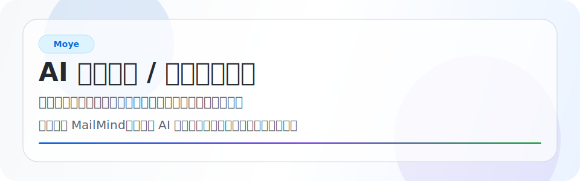
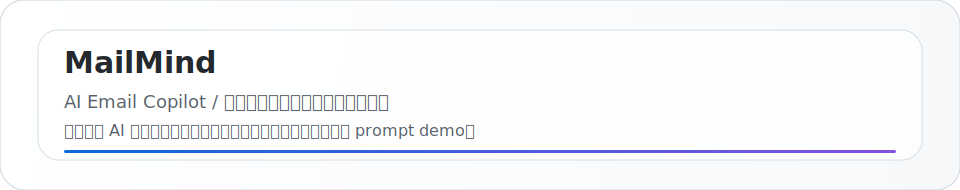

<picture>
  <source media="(prefers-color-scheme: dark)" srcset="./assets/profile-hero-dark.svg" />
  <source media="(prefers-color-scheme: light)" srcset="./assets/profile-hero-light.svg" />
  
</picture>

---

## 概览

| 卡片 | 内容 |
| --- | --- |
| 身份 | 计算机硕士，目前在一家量子计算独角兽企业内，从事量子计算机测控系统相关工作 |
| 方向 | 工程化、自动化、可复现工作流、AI 辅助开发和 AI 应用产品 |
| 项目 | 持续开发 [MailMind](https://github.com/Vibe-Coding-X/mailmind-ai-email-copilot)，一个 AI 邮件 Copilot 项目 |
| 博客 | [kanes.top](https://www.kanes.top)，记录技术、思考和阶段性复盘 |

## 当前关注

| 方向 | 我关心什么 |
| --- | --- |
| 量子测控 | 在量子计算独角兽企业内参与测控系统相关工程 |
| 系统工程 | 把复杂现实约束整理成可运行、可维护的软件系统 |
| AI 应用开发 | 当前重点关注方向，也在关注相关机会 |
| MailMind | 持续开发 AI 邮件 Copilot，把 AI 接入真实邮件工作流 |
| 数据与工具 | SQL、NoSQL、脚本、容器、工作流和可复现环境 |
| 写作 | 把模糊经验沉淀成可以被复盘、讨论和继续改进的文字 |

## 工作台

| 项目 | 状态 |
| --- | --- |
| 公司方向 | 某量子计算独角兽企业内的测控系统相关工程 |
| 日常实践 | 构建、测试、自动化、写作 |
| AI 使用 | 拆问题、写代码、查缺陷、做总结、提效率 |
| 个人项目 | MailMind / AI Email Copilot |
| 当前问题 | 如何把 AI 能力放进真实、可用、可持续的工作流 |

## AI 使用方式

| 场景 | 使用方式 |
| --- | --- |
| 需求拆解 | 把模糊目标拆成可执行步骤，明确约束、风险和验证方式 |
| 编码实现 | 快速生成初稿，再结合上下文审查、改写和验证 |
| 调试定位 | 用日志、错误信息和最小复现缩小问题范围 |
| 文档与总结 | 把工程过程整理成清晰的说明、记录和复盘 |
| 自动化 | 用脚本和工具减少重复操作，让工作流更稳定 |

## 技术栈

  <picture>
    <source media="(prefers-color-scheme: dark)" srcset="https://skillicons.dev/icons?i=py,java,postgres,mongodb,linux,bash,git,docker,md&theme=dark" />
    <source media="(prefers-color-scheme: light)" srcset="https://skillicons.dev/icons?i=py,java,postgres,mongodb,linux,bash,git,docker,md&theme=light" />
    
  </picture>

  

## Now

| 状态 | 内容 |
| --- | --- |
| working_on | 量子计算机测控系统 |
| company | 某量子计算独角兽企业 |
| building | MailMind / AI Email Copilot |
| thinking_about | AI 应用开发、邮件工作流、数据系统、自动化工具 |
| looking_at | AI 应用方向的相关机会 |
| writing_at | [kanes.top](https://www.kanes.top) |

## 持续项目

### [MailMind](https://github.com/Vibe-Coding-X/mailmind-ai-email-copilot)

<picture>
  <source media="(prefers-color-scheme: dark)" srcset="./assets/mailmind-card-dark.svg" />
  <source media="(prefers-color-scheme: light)" srcset="./assets/mailmind-card-light.svg" />
  
</picture>

## 博客

更长的技术记录、个人思考和阶段性复盘会放在这里：

  

## GitHub 动态

<table width="100%" border="0" cellspacing="0" cellpadding="0">
  <tr>
    <td colspan="3">
      <picture>
        <source media="(prefers-color-scheme: dark)" srcset="https://github-profile-summary-cards.vercel.app/api/cards/profile-details?username=moye12325&theme=github_dark" />
        <source media="(prefers-color-scheme: light)" srcset="https://github-profile-summary-cards.vercel.app/api/cards/profile-details?username=moye12325&theme=github" />
        
      </picture>
    </td>
  </tr>
  <tr>
    <td width="33.333%">
      <picture>
        <source media="(prefers-color-scheme: dark)" srcset="https://github-profile-summary-cards.vercel.app/api/cards/repos-per-language?username=moye12325&theme=github_dark" />
        <source media="(prefers-color-scheme: light)" srcset="https://github-profile-summary-cards.vercel.app/api/cards/repos-per-language?username=moye12325&theme=github" />
        
      </picture>
    </td>
    <td width="33.333%">
      <picture>
        <source media="(prefers-color-scheme: dark)" srcset="https://github-profile-summary-cards.vercel.app/api/cards/most-commit-language?username=moye12325&theme=github_dark" />
        <source media="(prefers-color-scheme: light)" srcset="https://github-profile-summary-cards.vercel.app/api/cards/most-commit-language?username=moye12325&theme=github" />
        
      </picture>
    </td>
    <td width="33.333%">
      <picture>
        <source media="(prefers-color-scheme: dark)" srcset="https://github-profile-summary-cards.vercel.app/api/cards/stats?username=moye12325&theme=github_dark" />
        <source media="(prefers-color-scheme: light)" srcset="https://github-profile-summary-cards.vercel.app/api/cards/stats?username=moye12325&theme=github" />
        
      </picture>
    </td>
  </tr>
  <tr>
    <td colspan="3">
      <picture>
        <source media="(prefers-color-scheme: dark)" srcset="https://github-readme-activity-graph.vercel.app/graph?username=moye12325&bg_color=0D1117&color=C9D1D9&line=58A6FF&point=58A6FF&area=true&hide_border=true" />
        <source media="(prefers-color-scheme: light)" srcset="https://github-readme-activity-graph.vercel.app/graph?username=moye12325&bg_color=FFFFFF&color=24292F&line=0969DA&point=0969DA&area=true&hide_border=true" />
        
      </picture>
    </td>
  </tr>
</table>

---

**生活的意义是什么呢？**

